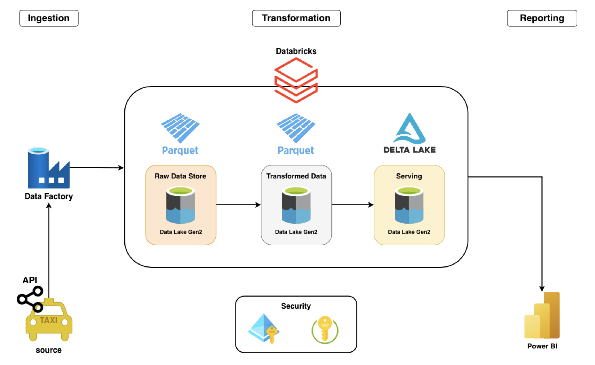
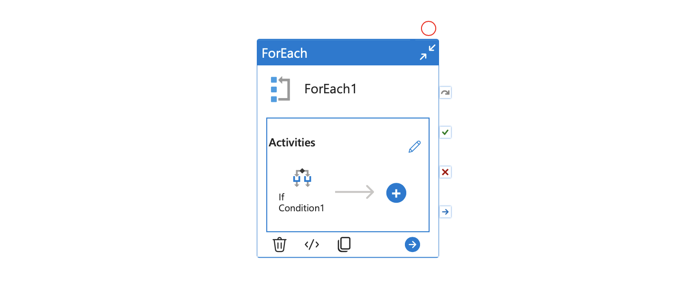

# Azure End-to-End Data Engineering Project — NYC Taxi (ADF + Databricks + Delta Lake)

This repository showcases an end-to-end **Azure Data Engineering** pipeline built using the **Medallion Architecture (Bronze → Silver → Gold/Serving)** on NYC Taxi trip data.

The project covers:
- Dynamic ingestion using **Azure Data Factory (ADF)**
- Storage in **ADLS Gen2** as **Parquet** (Bronze)
- Transformations using **Azure Databricks + PySpark** (Silver)
- Curated **Delta Lake** tables with governance concepts (Gold/Serving)
- Concepts like **Delta versioning** and **time travel**
- Connecting curated data to **Power BI** for reporting

---

## Architecture



---

## ADF Pipeline (Ingestion)



---

## Project Flow (Medallion Architecture)

### Bronze (Raw)
- ADF pulls data dynamically from a web/HTTP source (Parquet)
- Lands raw files into **ADLS Gen2** in **Parquet** format

### Silver (Transformed)
- Databricks reads Bronze Parquet files
- Applies PySpark transformations (cleansing, formatting, standardization)
- Writes transformed outputs to the Silver layer

### Gold / Serving (Delta Lake)
- Reads from Silver
- Creates **Delta tables**
- Explores Delta Lake features such as:
  - Delta log
  - Versioning
  - Time travel
- Uses governance concepts with **Unity Catalog** (managed tables, metadata, access control)

---

## Repository Structure

```
.
├── adf/
│   ├── factory/
│   │   ├── nyctaxighaydaDF_ARMTemplateForFactory.json
│   │   ├── nyctaxighaydaDF_ARMTemplateParametersForFactory.json
│   │   ├── ARMTemplateForFactory.json
│   │   └── ARMTemplateParametersForFactory.json
│   └── NYC-Taxi-pipline.png
├── architecture/
│   └── NYC-taxi-architecture.png
├── databricks/
│   ├── Silver Notebook.ipynb
│   └── Gold Notebook.ipynb
└── README.md
```

---

## Tech Stack
- Azure Data Factory (ADF)
- Azure Data Lake Storage Gen2 (ADLS)
- Azure Databricks
- PySpark
- Delta Lake
- Unity Catalog
- Power BI
